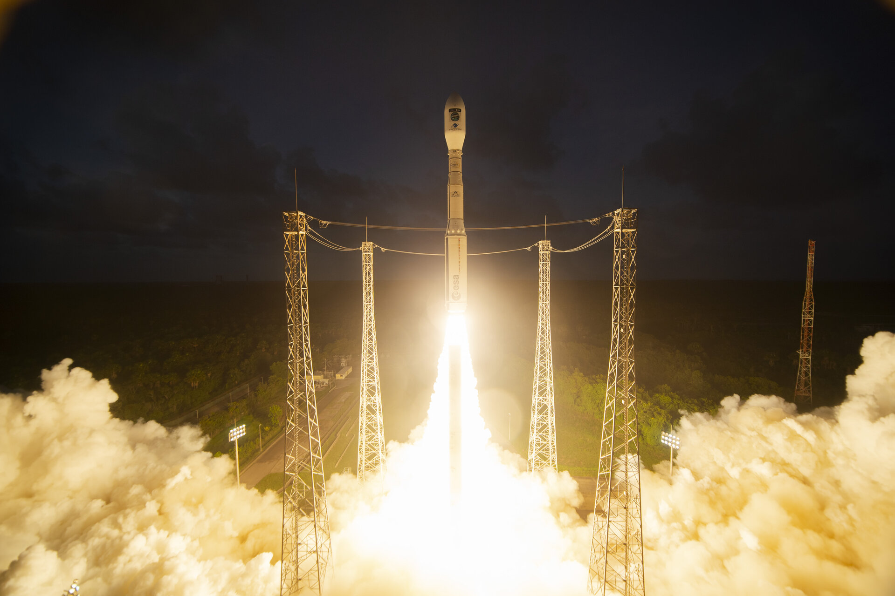
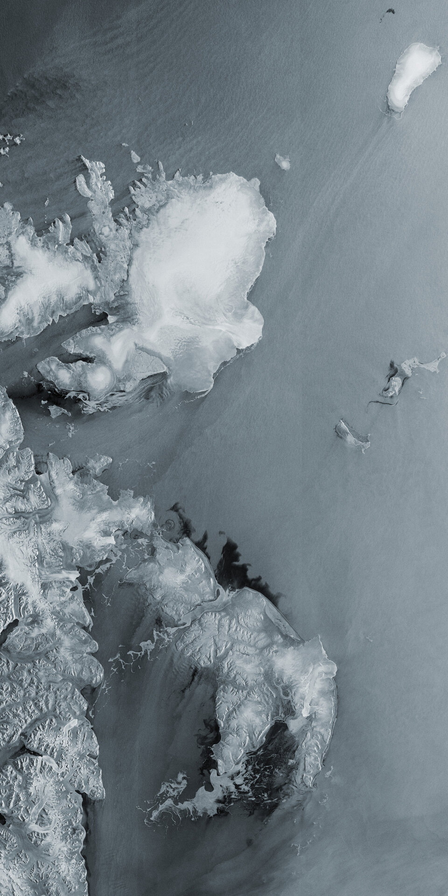

```{r setup, include=FALSE}
options(htmltools.dir.version = FALSE)
knitr::opts_chunk$set(
  fig.width=9, fig.height=3.5, fig.retina=3,
  out.width = "100%",
  cache = FALSE,
  echo = TRUE,
  message = FALSE, 
  warning = FALSE,
  hiline = TRUE
)
```

```{r xaringan-themer, include=FALSE, warning=FALSE}
library(xaringanthemer)
style_duo_accent(
  primary_color = "#1381B0",
  secondary_color = "#FF961C",
  inverse_header_color = "#FFFFFF"
)
```

## Sentinel-1C: Background

.pull-left[
### Key Details
- **Launch Date**: 5th December 2024 launched
- **Who**: Joint initiative by the *European Commission* and *European Space Agency*
- **Orbit Altitude**: 693km
- **Mission Life**: 7 years

### Mission Design
- The Sentinel 1 mission was designed as a two satellite mission so the **Sentinel-1C** will synchronise with **Sentinel-1A** 180° apart.
- It will replace **Sentinel-1B** which has been out of service due to power issues since August 2022 


source: https://www.esa.int/Applications/Observing_the_Earth/Copernicus/Sentinel-1 and https://www.esa.int/Applications/Observing_the_Earth/Copernicus/Sentinel-1/Introducing_Sentinel-1

]

.pull-right[



**Sentinel 1C Launch**
*Source*: [*European Space Agency*](https://www.esa.int/Applications/Observing_the_Earth/Copernicus/Sentinel-1/Double_win_for_Europe_Sentinel-1C_and_Vega-C_take_to_the_skies)

]
---
name: colors

## Sentinel-1C: Background

.pull-left[
### Sentinel 1 mission focus

-  Provide all weather, day and night imagery for land and ocean services:  
    - **Climate change monitoring**  
    - **Disaster response** (e.g., flooding, earthquake events)  
    - **Long-term Earth observation** of land, oceans, and ice


**Sentinel 1C** is currently in its commissioning phase with **full operations** expecting to begin within the next few months. 
- Once it is synchronised it will reduce revisit time of images from every **12 days** to every **6 days**.
]

.pull-right[

**First Image from Sentinel-1C: Svalbard, Norway**
*Source: [ESA](https://www.esa.int/Applications/Observing_the_Earth/Copernicus/Sentinel-1/Sentinel-1C_captures_first_radar_images)*


]


---
## Synthetic Aperture Radar (SAR)


One of the key features of Sentinel 1 satellites is the Synthetic Aperture Radar instrument onboard.
.pull-left[
#### What is it?
- An active radar sensor that creates high-resolution images of Earth. 
- Capable of imaging through clouds and in total darkness, making it valuable for all-weather, day-and-night applications.
- Operates in four imaging modes with resolution ranging from 5m to 400 km.
]

.pull-right[
#### How does it work?

-  transmit microwave radar pulses to Earth's surface, which reflect and return to the receiver
- As the radar antenna moves along its flight path, it captures reflections from the same area at different angles.
- These multiple angles simulate a larger "synthetic aperture" for higher resolution.
- Signal processing algorithms then reconstruct these reflections into 2D images of the surface
]


---


# Applications: SHIP MONITORING

Sentintel-1C offers an improvement on Sentinel-1A's ship monitoring capabilities with the addition of Automatic Identification System (AIS):


- AIS is a system where ships report their identities and position.
  - Combines radar imagery with AIS signals, wil be able to provide detailed information about ship location, course, and identity.
  - Enabling a view of global shipping traffic and assist in detecting illegal piracy.


---


# Application: Oil pollution monitoring


- Oil slicks are distinctly in SAR images
- Detection can now be combined with AIS to help determine the offending ship/s.

.pull-left[
In the gif on the right, Sentinel-1A captures an oil spill from a ship collision near Corsica, France.

Combined with AIS data, the Sentinel-1 mission can now help identify responsible ships and support environmental enforcement efforts.

Image Source:
https://sentiwiki.copernicus.eu/web/s1-applications
]

.pull-right[

]


---

# Reflection


.pull-left[
### Working in pairs vs Solo

- I found it interesting to learn how satellites can work in pairs in order to reduce revisit time. 
- Despite the high costs of sattellites, I think this highlights the value and importance of frequent and available data of the Earth's surface. Monitoring would not be so useful if the revisit time is too long.  
- This also increases the resilience of the mission as the mission remained operational despite Sentinel-1B's two-year downtime.
]


.pull-right[
### Room for improvement with each launch

- These satellites have a 5–7 year lifecycle, creating opportunities to upgrade technology with each replacement.
- This does not seem long, and it means the ESA are constantly planning for new launches and contingency plans.
- but on the other hand it does allow each new satellite to learn from its predecessors and not be limited beacuse of aging technology.


]


---


---
class: center, middle

# References

Slides created via the R packages:

[**xaringan**](https://github.com/yihui/xaringan)<br>
[gadenbuie/xaringanthemer](https://github.com/gadenbuie/xaringanthemer)

The chakra comes from [remark.js](https://remarkjs.com), [**knitr**](http://yihui.name/knitr), and [R Markdown](https://rmarkdown.rstudio.com).
